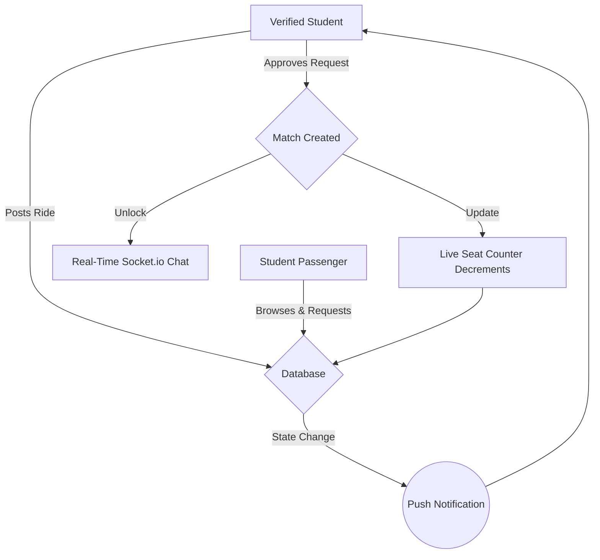

# Crewmute | Campus Carpool & Mobility SaaS

**Crewmute** is a highly scalable, real-time campus carpool platform built specifically for Indian college students. It digitizes the fragmented process of finding shared cabs for weekend travel home, replacing chaotic WhatsApp groups with a dedicated, verified mobile ecosystem.

It showcases an enterprise-grade mobile architecture featuring real-time WebSockets, robust observability, and strict institutional identity verification.

---

## 🌟 Vision & Impact

Every weekend, thousands of students spend hours coordinating intercity travel. Crewmute solves this by providing a centralized marketplace for verified students to post rides, request seats, and seamlessly coordinate through in-app chat.

### Core Value Proposition
- **Institutional Trust:** Mandatory college email OTP verification and student ID fallbacks ensure a safe, closed-ecosystem community.
- **Real-Time Logistics:** Live seat counters, automated ride expiration upon departure, and instant push notifications for state changes.
- **Frictionless Coordination:** 1:1 real-time Socket.io chat unlocks automatically the moment a ride request is approved.
- **Accessibility-First Design:** Fully compliant with WCAG 2.1 AA standards, featuring robust dark/light modes, 44pt touch targets, and reduced-motion optimizations.

### Platform Lifecycle Architecture

---

## 🛠️ Architecture Highlights

- **Mobile Client**: React Native 0.81, Expo SDK 54, Expo Router v6, NativeWind 4, Zustand 4, Reanimated 4.
- **Backend Services**: Node.js 20 LTS, Express 4, TypeScript 5.
- **Database & Data Layer**: MongoDB Atlas, Mongoose 8, TanStack Query 5.
- **Real-Time Engine**: Socket.io (Client & Server) for instant chat and ride state syncing.
- **Security**: JWT (15m access / 7d refresh), bcrypt (12 rounds), Zod payload validation.
- **Observability**: Prometheus metrics, Pino structured logging, AsyncLocalStorage request tracing.

---

## 📂 System Topography

### Mobile Experience (`/mobile`)
- **Discovery Engine** — Browse and filter active rides by route and date.
- **Booking Flow** — Request seats, accept/reject applicants, and withdraw requests.
- **Live Chat** — Instant messaging via WebSockets with read receipts.
- **Identity Profile** — Cloudinary photo uploads, college identity badges, and verification states.

### Core Infrastructure (`/backend`)
- **Identity Provider** — Custom OTP email flow and JWT lifecycle management.
- **Fleet State Machine** — Manages ride capacity, auto-expiration cron jobs, and match state.
- **Notification Service** — Triggers push notifications on every critical ride or chat event.

---

## 📄 License & Copyright

**All Rights Reserved.**

This repository contains proprietary source code created for **Crewmute**. It is made public strictly for **portfolio showcase purposes**. 

You are **NOT** permitted to use, copy, modify, merge, publish, distribute, sublicense, or sell copies of this software, its design assets, or its proprietary components under any circumstances. 

---
*Developed with ❤️ by Pahul.*
